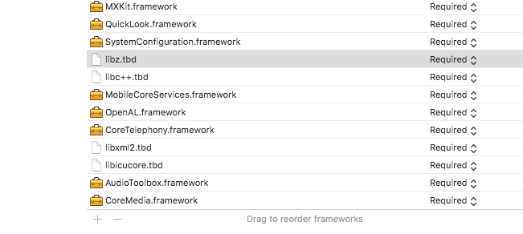
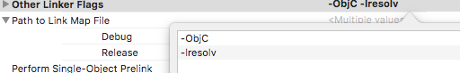

# iOS快速集成指南

## 下载sdk

## 导入sdk以及工程设置

1. 拷贝MXKit.framework、MXKitResources.bundle和MXKit_Version.txt到相应得工程目录下，并且添加到工程里     
2. 在工程文件的Build Phases 里面添加用到的Libraries:   
     
   

3. 在target的build setting里面添加 -ObjC和-lresolv  
   

## 编码实现

使用MXKit.framework需要按照以下流程实现：

### 1.引入头文件

```objc
#import <MXKit/MXKit.h>
```

### 2.初始化

```objc
//将宏定义设置为1
#define MX_DISABLE_SHARE_EXTENSION 1
MXKit *MXObj = [MXKit shareMXKit];
//将主程序的windows传到MXKit里面去，MXKit里面的一些UI操作会用到
[MXObj setWindowToMXKit:self.window];
#ifdef MX_DISABLE_SHARE_EXTENSION
[MXObj initDisableShareExtension:MX_DISABLE_SHARE_EXTENSION];
#endif
//MX_URL:敏行server的地址 e.g @"http://www.minxing365.com"
//MX_PORT:敏行server的端口 e.g @"80"
//MX_MQTT_URL: mqttserver的地址 e.g @"www.minxing365.com"
//MX_MQTT_PORT: mqtt server的端口 e.g @"1883"
[MXObj init:MX_URL withPort:MX_PORT withMqttUrl:MX_MQTT_URL withMqttPort:MX_MQTT_PORT];
//初始化umeng，这个是可选操作
[MXObj initUmeng:UMENG_KEY withChannel:UMENG_CHANNEL];
```

### 3.调用登陆接口

在执行任何操作之前需要先调用敏行的登陆接口获取到人员信息。  
我们提供2个login的接口，一个是第一次登陆输入用户名和密码，另一个是已经登陆的用户下次再启动app直接登陆的接口  
1.需要用户名密码：

```objc
MXKit *MXObj = [MXKit shareMXKit];
[MXObj login:name withPassword:password];
```

2.已经登陆过的用户直接登陆

```objc
MXKit *MXObj = [MXKit shareMXKit];
[MXObj login:^(id result, MXError *error){
    if(result && !error) {
        //登陆成功之后进行其他的操作
    }
}];
```
3.登录成功后回调
```objc
[MXObj registLoginCallback:^(id result, MXError *error){
      if(result && !error)
        {
          [self initapp];
        }
     }];
 
 ```

### 4.向敏行server注册设备

当app获取到deviceToken之后需要向敏行server注册

```objc
-(void)application:(UIApplication *)application didRegisterForRemoteNotificationsWithDeviceToken:(NSData *)deviceToken {
    NSString *fullDeviceToken = [NSString stringWithFormat:@"%@",deviceToken];
    NSString *deviceTokenStr = [[fullDeviceToken substringWithRange:NSMakeRange(1, [fullDeviceToken length]-2)]stringByReplacingOccurrencesOfString:@" " withString:@""];
    //这里用户可以把deviceToken存储起来，需要的时候向敏行server注册，也可以直接注册
    [[MXKit shareMXKit] registDeviceTokenToserver:deviceTokenStr];
}
//如果是模拟器，失败的情况下也需要想敏行server注册
- (void)application:(UIApplication *)application didFailToRegisterForRemoteNotificationsWithError:(NSError *)error {
    [[MXKit shareMXKit] registDeviceTokenToserver:nil];
}
```

### 5将主app的系统delegate传递给kit

```objc
//定义
- (BOOL)application:(UIApplication *)application didFinishLaunchingWithOptions:(NSDictionary *)launchOptions;//应用程序启动后，要执行的委托调用  
-(BOOL)application:(UIApplication *)application openURL:(NSURL *)url sourceApplication:(NSString *)sourceApplication annotation:(id)annotation;//应用之间跳转
- (void)application:(UIApplication *)application didRegisterForRemoteNotificationsWithDeviceToken:(NSData *)deviceToken;//向服务器注册token
- (void)application:(UIApplication *)application didFailToRegisterForRemoteNotificationsWithError:(NSError *)error;如果是模拟器，失败的情况下也需要想敏行server注册
- (void)application:(UIApplication *)application didReceiveRemoteNotification:(NSDictionary *)userInfo;//推送
- (void)applicationWillResignActive:(UIApplication *)application;//应用程序将要由活动状态切换到非活动状态时执行的委托调用，如按下home 按钮，返回主屏幕，或全屏之间切换应用程序等。  
- (void)applicationDidEnterBackground:(UIApplication *)application;//在应用程序已进入后台程序时，要执行的委托调用。所以要设置后台继续运行，则在这个函数里面设置即可。  
- (void)applicationWillEnterForeground:(UIApplication *)application;//在应用程序将要进入前台时(被激活)，要执行的委托调用，与applicationWillResignActive 方法相对应。  
- (void)applicationDidBecomeActive:(UIApplication *)application;//在应用程序已被激活后，要执行的委托调用，刚好与  applicationDidEnterBackground 方法相对应。  
- (void)applicationWillTerminate:(UIApplication *)application;/在应用程序要完全退出的时候，要执行的委托调用。  
-(void)application:(UIApplication *)application performFetchWithCompletionHandler:(void (^)(UIBackgroundFetchResult))completionHandler;
//示例
//在appdelegate.m里，各个api的使用方法相同，这里以进入后台的事件为例
- (void)applicationDidEnterBackground:(UIApplication *)application {
    MXKit *MXObj = [MXKit shareMXKit];
    [MXObj applicationDidEnterBackground:application];
}
```

至此用户就可以调用我们各个模块的api来进行集成了。

